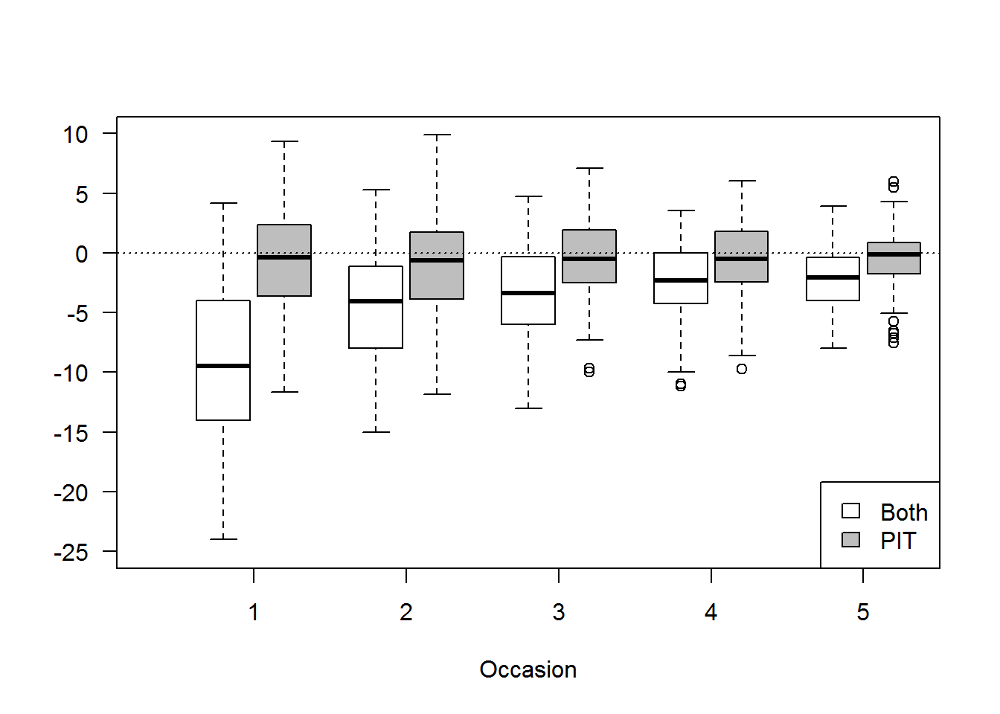
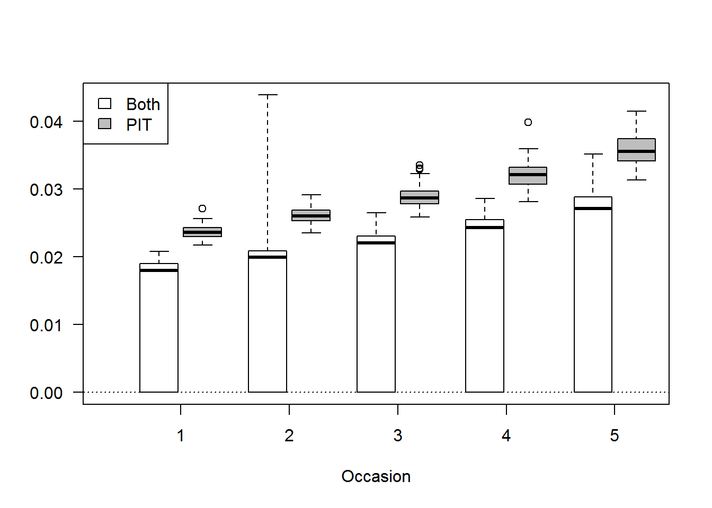

## Parameters for the robust design

* $\phi$ or $S$ is survival
* $c$ is initial capture probability
* $p$ is recapture probability
* $\Gamma$ is the seniority parameter
* $f_0$ is number of unobserved individuals
* $\gamma^{\prime}$ is the probability of being unobservable (i.e., offsite) at t-1 and remaining unobservable at t
* $\gamma^{\prime\prime}$ is the probability of being observable (i.e., offsite) at t-1 and unobservable at t

The $\gamma$ parameters are bit tricky.  They represent 4 possible states that a critter can transition from.
Specifically they can transitions from:

* unobservable to unobservable ($\gamma^{\prime}$)
* unobservable to observable (1-$\gamma^{\prime}$)
* observable to unobservable (1-$\gamma^{\prime\prime}$)
* observable to observable (1-$\gamma^{\prime\prime}$)

## Objectives

The objectives of this simulation are to

1. Figure out how to incorporate auxiliary information in Program Mark for a robust design, and
2. Evaluate the benefits of using additional information.

## Some background

It is common in fisheries studies to tag all fish handled.
Tagging is usually done with a cheap individual tags or batch markings.  
Recaptures of tagged fish can be used to estimate demographic rates, abundance, or both.
In some studies a small subset of fish are tagged with more expensive acoustic or radio tags.
Acoustic and radio tags provide additional information from passive or active tracking on movement (hereafter tracking tags refers to acoustic or radio tags).
Tagging the entire population with acoustic or radio tags it typically prohibitively expensive.
Cost limitations result in 3 populations of fish those that are: never captured (unmarked), captured and individually tagged, and captured and tagged with an indvidual tag and a tracking tag.
Fish tagged with tracking tags are a subset of the tagged population they are rarely used in capture recapture analyses because it is not clear how this information can be incorporated into demographic or poulation estimates.

Tracking tags provide unique information because they do not require the fish to be physically captured.
The main benefit of using tracking tags is that they can be detected with certainty in most conditions.  
Are there estimates of detection probability?  what are this range, ect
Because tracking tags can be located with certainty, the location of the tagged fish can be accurately determined.

* For example, xxx {acoustic tags and location}
* Demographic or survival example
* Any studies using acoustic tags to get a abundance?

Tracking tags are commonly used for evaluating fish movement and habitat use but rarely used to estimate demographic rates or abundance.  

* Support 1
* Support 2
* Support 3

Use of tracking tags to estimate population rates or abundance is likely unused because of resource limitations (i.e., too few tags).
However tracking tags can provide additional information on capture probabilities estimated by capture recapture models.
Specifically, knowing tagged fish are present during a capture occasion can inform capture probabilities.
Suppose a capture recapture study uses 4 events to capture and recapture fish.  
At the study location there were 10 fish with tracking tags identified, one of which was captured on the 3rd event.
Conditional capture probabilities can be estimated by repeated attempts to capture individuals that are known to be in the study area.
For example Steffenson et al. (xxxx) used repeated efforts to attempt to capture acoustic tagged Pallis Sturgeon in the Missouri River.
Similarly, Guy et al. (xxxx) ....

# Methods

1. Ginned up a function to simulation a robust design with tracking and indvidual tags
2. Simulated 5 primary occasions, 8 secondary occasions with known parameters that did not vary among primary and secondary occasion
3. Fit a model that allowed for the inclusion of tracking tags by fixing $p$ at 0 or 1 depending on when the fish was captured and tagged
4. Fit the model to the PIT tag only capture histories
5. Compared parameter bias, discrepancy, and standard error

# Results

## Parameter estimates

* Including both tags really biased $\gamma^{\prime\prime}$ and $\gamma^{\prime}$

## Abundance estimates

Using both was not great, underestimted the true abundance, result of bias in $\gamma^{\prime\prime}$ and $\gamma^{\prime}$

## Abundance estimate precision (CV)

I do not believe the standard error estimates for using both.  I believe they are smaller than PIT only but not 0.

# Discussion

* There seems to be something very off with the acoustic fish that was unexpected.
* Going to try to work only on acoustic fish
* What I think might be happening is that if you have capture history of 10000, tracking tag detection and no physical
captures it over estimates  the probability of Observable --> observable (i.e., 1-$\gamma^{\prime\prime}$) and therefore
$\gamma^{\prime\prime}$ is underestimated
* First test is to fix $\gamma^{\prime\prime}$ and $\gamma^{\prime}$ to zero in simulated data and in the design matrix to 
see if that clears up the bias in abundance.

